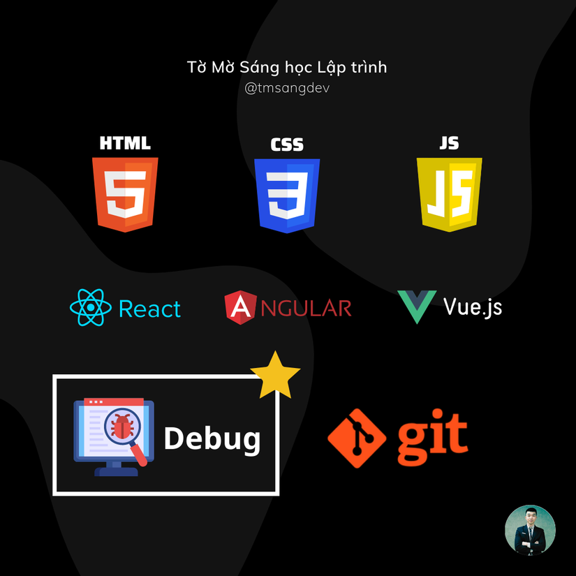
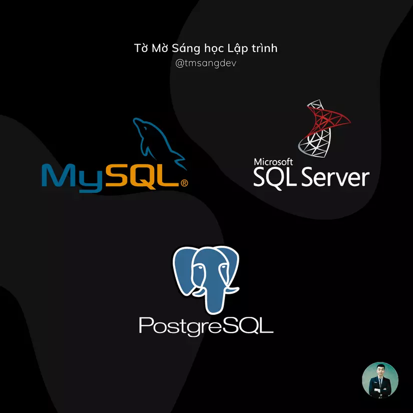
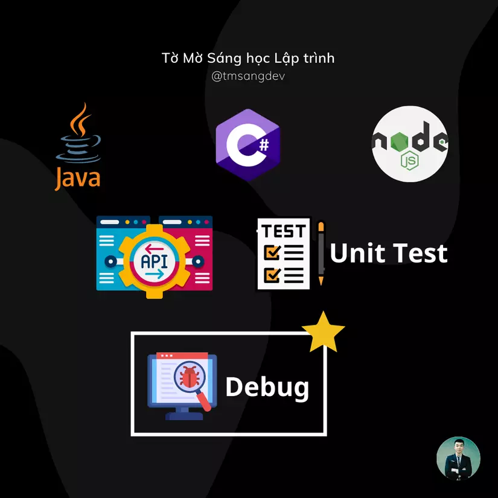

Hi vọng bài viết này sẽ đến tay những bạn mất phương hướng và đang cần đến nó
> LƯU Ý: 
> 
> Những kiến thức mình liệt kê dưới đây mới là ở mức cơ bản, học xong những kiến thức này, các bạn có thể có cơ hội tìm được công việc lập trình Web Fullstack đầu tiên.
> 
> Sau khi vào dự án rồi thì sẽ còn rất nhiều kiến thức nâng cao mình cần bồi dưỡng theo thời gian. 
> 
> Hi vọng các bạn sẽ luôn giữ trong mình khát khao tìm tòi và học hỏi để mở rộng hơn kiến thức và kỹ năng của mình nhé 📚️

Bạn có thể lựa chọn 1 trong 2 lộ trình này:

**1. Frontend -> Database -> Backend**

**2. Database -> Backend -> Frontend**

Lý do mình khuyên nên học DB trước BE để khi code BE bạn có thể gọi hàm lấy dữ liệu từ DB ra luôn. Đỡ phải fake dữ liệu ở BE.
Về từng phần học thì bạn có thể học như sau:

## 1. FRONTEND:

- HTML
- CSS
- JS
- Debug code JS sử dụng Chrome Devtools
- Học 1 framework/library nào đó như ReactJS, Angular, VueJS, ... để làm quen với cách phân chia component và Single Page App (SPA). Bây giờ đa phần web app đều code theo SPA.
- Debug code (sử dụng Chrome Devtools hoặc Visual Studio Code) ⭐️
- Học sử dụng Git để quản lý mã nguồn
Tổng quan về FE, ngoài nhưng kiến thức code cơ bản thì **QUAN TRỌNG NHẤT** là **KỸ NĂNG DEBUG** ⭐️, vì khi đi làm phải debug, fix bug rất nhiều. 

## 2. DATABASE:

- Mới bắt đầu thì có thể chọn học relational database (cơ sở dữ liệu quan hệ) như MySQL hoặc SqlServer
- Các cú pháp cơ bản như kiểu dữ liệu, các câu lệnh, constraint
- Học cách đánh index
- Transaction
- Sinh dữ liệu fake
- Backup/Restore database phòng ngừa rủi ro
- Phân tích bài toán để cấu trúc các bảng, mối quan hệ giữa các bảng cho phù hợp
- Xa xôi nữa có thể học NoSQL, nhưng nếu bạn bắt đầu học từ đầu thì ko nên ôm đồm học nhồi nhét quá. Vững chắc từ cơ bản trước

## 3. BACKEND:

- Có thể chọn học lập trình hướng đối tượng, vì các công ty ở Việt Nam vẫn ưa chuộng loại này
- Lựa chọn 1 ngôn ngữ để học: Java, C#, NodeJS, ... Như mình là mình theo C#. Cứ thấy cái tên nào hợp phong thuỷ thì bạn học cũng được. Sau này việc chuyển qua ngôn ngữ khác không khó, tư tưởng cơ bản giống nhau. Chỉ khác cú pháp
- Học các cú pháp cơ bản về biến, if else, for while, function, class, object, ...
- Học thiết kế API chuẩn RESTful. Sau này làm việc với các lập trình viên khác cho dễ
- Học cách sử dụng thư viện, cách gọi vào DB để lấy dữ liệu
- Học cách phân chia cách layer code rõ ràng, mỗi layer làm 1 nhiệm vụ riêng biệt như mô hình 3 layer: API Controller + Business Logic + Data Access.
- Học cách debug code BE ⭐️
- Học viết Unit test để tự tin nói code mình đúng logic, đã test tủng cẩn thận

## KẾT BÀI:

Trên đây là lộ trình của 1 fullstack dev cơ bản. Sau đó, sẽ trau dồi thêm các kiến thức nâng cao về Job/Worker, lập trình bất đồng bộ, microservice, authentication/authorization, ...

Cảm thấy sự thú vị thì sẽ muốn Học, Học nữa, Học mãi. Chúc bạn thành công 🤜🤛

Ở các bài viết tiếp theo, mình sẽ bắt đầu chia sẻ kiến thức về Database. Mời các bạn cùng đón xem!